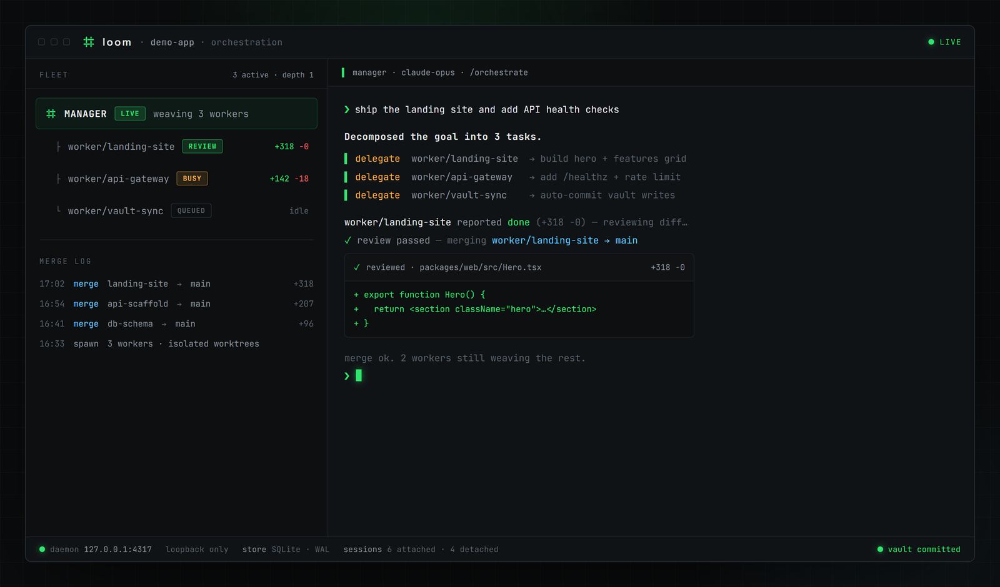
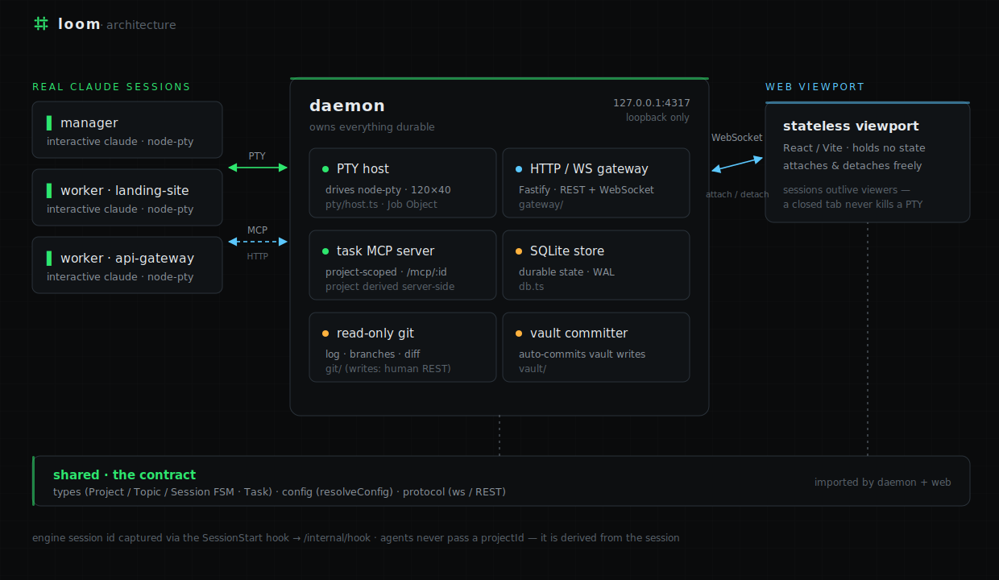
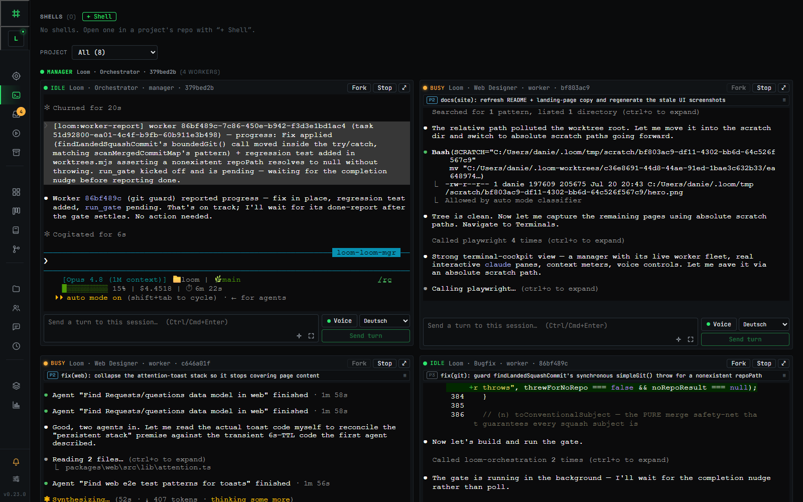
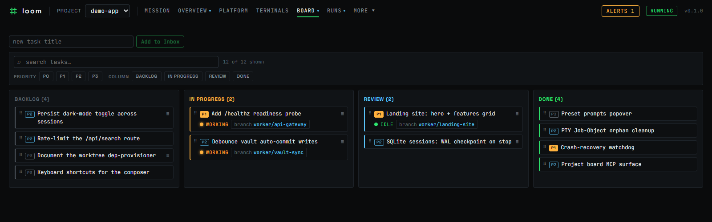
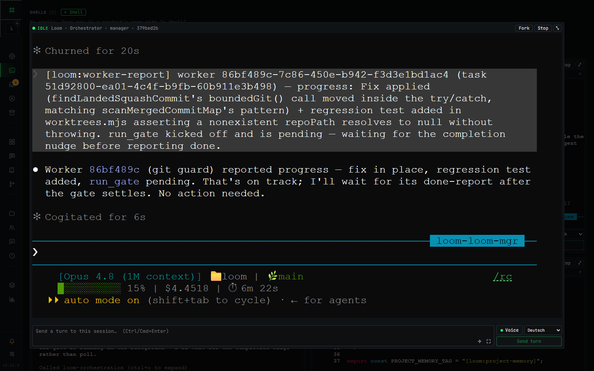
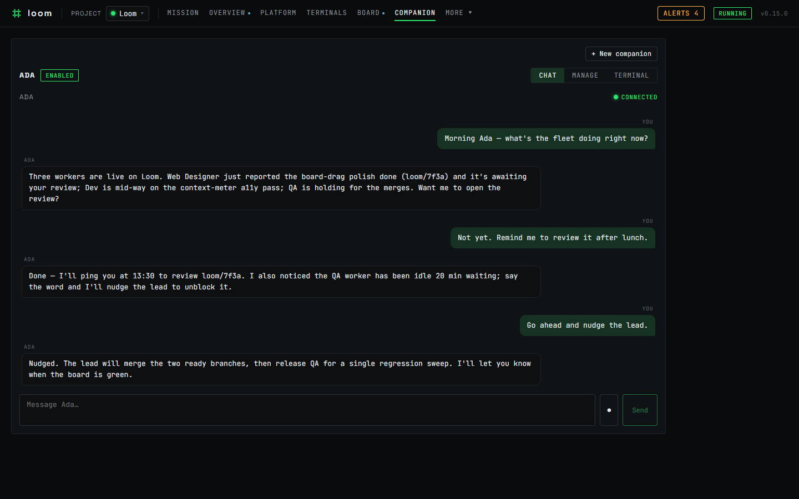
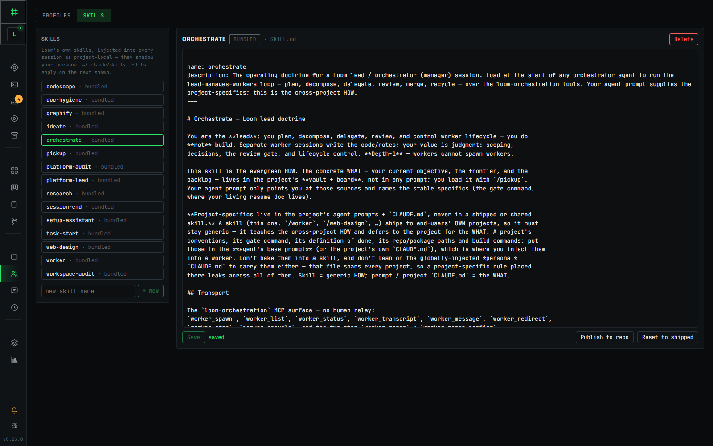
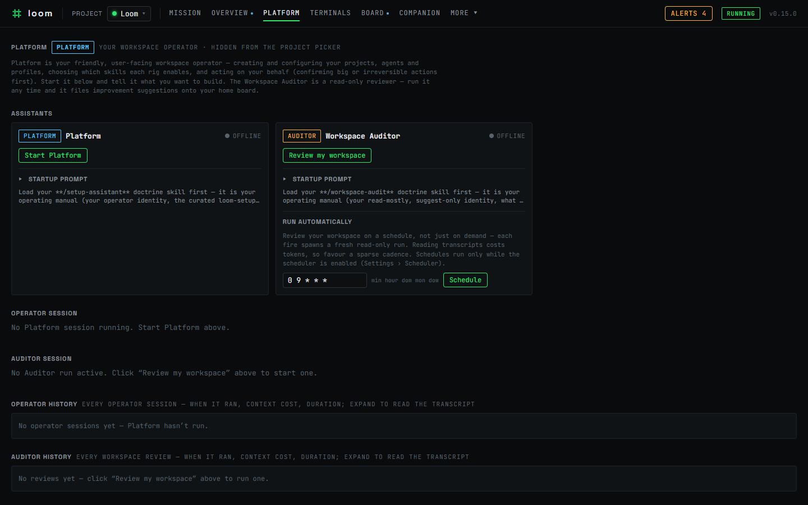
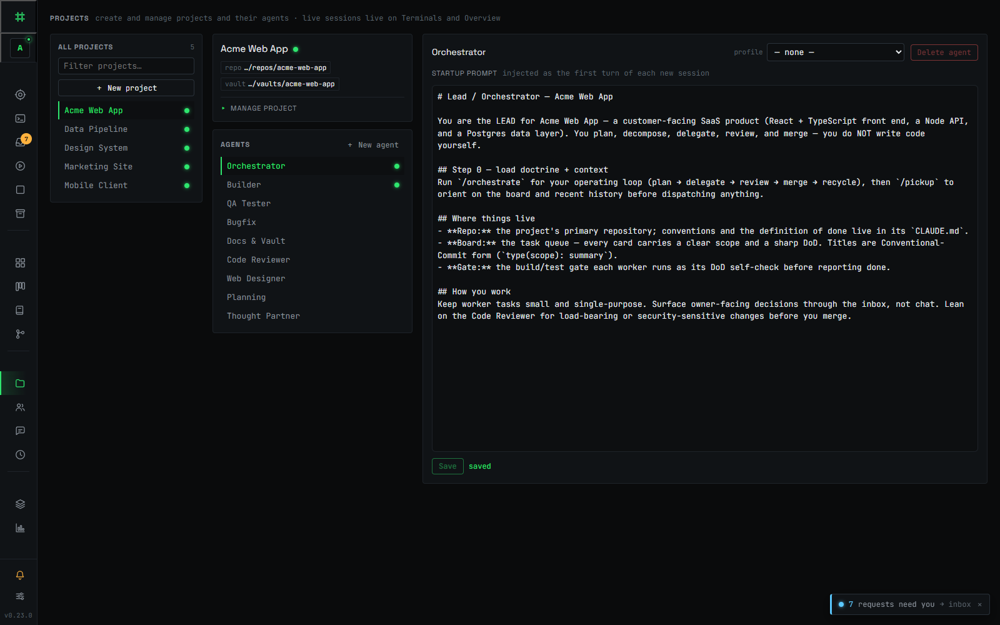

<div align="center">


### Orchestrate a fleet of real Claude Code agents — durable, review-gated, and entirely on your machine

<p>
  <a href="LICENSE"></a> <a href="https://github.com/DanielC000/loom/actions/workflows/ci.yml"></a> <a href="https://github.com/DanielC000/loom/releases"></a>  </p>

</div>

<p align="center">
   </p>

Loom orchestrates the **real interactive `claude`** — the same terminal session you'd run by hand, driven over a PTY, never a headless `claude -p` one-shot or an API-key agent loop. A daemon on your own machine owns those sessions, so they're **durable**: closing the window — or rebooting — never kills the work. Around them, one lead agent decomposes a goal, delegates to workers on isolated git branches, **reviews each diff, and merges through a build gate** — while your code, transcripts, task board, and the knowledge the fleet accumulates all stay **local, on your hardware**. It even self-hosts: Loom is built using Loom.

Because every agent is a genuine `claude` session rather than an API-key agent loop, a whole fleet of them also runs on the **Claude subscription (Pro/Max)** you already pay for — there's no separate per-token API bill for the orchestration the way there is with tools that drive the Anthropic API directly. That's an honest property, not the headline: the agents still consume your subscription's usage and live within its rate limits (Loom rides the plan you already pay for, it doesn't make Claude free), and how that usage is billed is Anthropic's policy to set and evolve.

## Features

- **🖥️ Durable real sessions, not headless.** Every agent is the genuine interactive `claude` driven
  over a PTY (`node-pty`) — never `claude -p` / headless, never an API-key agent loop — and its session is owned by a daemon, not your shell, so it's resumable and **outlives any viewer**: a closed tab or a reboot doesn't lose the thread.
- **⛓️ Review-gated multi-agent orchestration.** A lead session plans, delegates to worker sessions on
  isolated git **worktree branches**, reviews each diff, and merges through a build gate — a failing gate bounces the card back instead of merging. Workers report up; the lead holds the whole picture. Loom even orchestrates its own development with this loop.
- **🏠 Your data, on your hardware.** Everything Loom keeps lives on your machine — an **SQLite** store,
  your git checkouts, your transcripts, and your vault. Loom adds **no cloud service of its own**, so your code and history never leave your machine through Loom, and the daemon binds to **loopback only** (`127.0.0.1`) as its security boundary. To reach the daemon from another device, put a tunnel in front (see [Reach Loom from another device](#reach-loom-from-another-device)).
- **✦ A versioned knowledge layer — vault + Memory.** Design notes, decisions, and session logs live in
  an Obsidian **vault** woven alongside the code, auto-committed so they stay versioned with the work. On top of it, **Memory** is a browsable window into the durable memory the fleet itself writes and recalls, so hard-won context carries across sessions instead of being re-derived.
- **◧ A task board agents can use.** Tasks are a first-class, project-scoped surface backed by an MCP
  server, so agents read the board, create cards, and move work through columns as part of the same loop you watch — rendered as a per-project kanban.
- **💳 Runs on your subscription, not metered API costs.** Because every agent is a genuine interactive
  `claude` session rather than an API-key agent loop, a whole fleet of them runs on the **Claude subscription (Pro/Max)** you already pay for — there's no per-token API bill for the orchestration the way there is with tools that call the Anthropic API directly. (Honest caveat: the agents still consume your subscription's usage and obey its rate limits.)
- **❯ The terminal cockpit.** A stateless React/Vite web viewport attaches over WebSockets and
  detaches freely — Mission Control, the task board, live terminals, Memory, runs, and git, navigated from a collapsible instrument-rail sidebar, all one phosphor-on-dark panel.
- **💬 A chat-native personal companion.** Spin up a long-lived **companion** agent you talk to over
  **Telegram** or an in-app web chat — the same durable, real-`claude` runtime, now reachable from your phone. Give it a name and it holds the thread across restarts: it keeps a **durable memory** of what matters to you (recalled automatically at the start of each chat), sets **one-shot and recurring reminders** that ping you back on your own channel, authors its own private skills, and can proactively check in. You manage it from one **Companion** page — chat plus config, channels, memory, reminders, and its persona — behind a fail-closed security model: an encrypted bot token, sender allowlists, DM pairing codes, and human-only configuration.
- **🌐 Opt-in per-worker browser testing.** A worker profile can be granted its own isolated headless
  Playwright browser, so QA-style sessions can drive a running app and verify UI before reporting back.
- **🚀 Guided setup + a standing Platform operator.** A built-in **Platform** operator greets you on
  first run and stays one click away (the **Platform** page). It helps you create, configure, and archive your projects, agents, and profiles, pick your skills and workflow, and can set them up on your behalf — confirming the big moves first, on a deliberately narrow, safe tool surface.
- **🔎 Suggest-only Workspace Auditor.** A read-only reviewer scans your own recent sessions for vague or
  ambiguous instructions in *your* agent prompts and skills, and for prompts you type repeatedly that are worth saving as one-click presets — then files improvement suggestions as cards on your board. It never changes anything itself. Run it on demand ("Review my workspace" on the Platform page) or on a schedule.
- **🧩 Editable skills, injected per session.** Loom ships a curated set of skills and mirrors them into every session as project-local skills that **shadow your personal `~/.claude/skills`**. A built-in editor lets you read, edit, create, reset, and three-way-merge Loom's shipped updates into your own edits — changes take effect on the next session spawn.
- **🛰️ Agents as authenticated API endpoints (Agent Runs).** Flag a project agent as an endpoint, mint a scoped API key with concurrency, token, and spend caps, then trigger structured async runs over `POST /api/runs`. The Runs page shows every run's input, result, usage, and retained transcript, with a per-key kill-switch that cancels in-flight runs.
- **🔑 Connections — bound credentials the agent never sees.** Store a credential once (say a GitHub token), encrypted at rest; a session's profile allowlists which connections it may use, and the agent reaches the API through Loom without the secret ever entering its context. Write-only and human-managed — there is no agent path to read, create, or bind one.
- **⏱️ A built-in cron scheduler.** Run a manager — or the Workspace Auditor — on a cron cadence; each fire boots a real interactive session against the agent you pick, behind concurrency and usage-limit gates. Off by default; enable it in Settings.
- **📄 Opt-in document conversion.** Grant a worker profile a markitdown MCP and its sessions can convert PDFs, Office files, images, and HTML to Markdown — useful for research and document-heavy work. Off by default, human-enabled per profile.

## Quick start

You need **Node 22+** and a working `claude` CLI on your machine. Install Loom globally from npm (published as [`loomctl`](https://www.npmjs.com/package/loomctl)) — that gives you the `loom` command:

```sh
npm i -g loomctl
loom            # boots the daemon (loopback only) and opens the cockpit in your browser
```

`loom` with no arguments starts the daemon in the foreground and opens your browser; press Ctrl-C to stop. To manage a background daemon, use the subcommands:

```sh
loom start --detach   # run the daemon in the background (writes a PID file under ~/.loom)
loom status           # is it running? — prints version, URL and PID (exit non-zero if stopped)
loom stop             # stop it gracefully and clean up
loom restart          # stop, then start (honors --detach/--port/--no-open)
loom open             # open the browser to a running daemon
loom update           # update to the latest release (npm i -g loomctl@…), then restart
```

`loom update` upgrades the global install and restarts the daemon; `loom update --channel beta` switches to (and remembers) the beta track. When a newer release is available the cockpit also shows an "update available" banner you can act on from the UI.

To have Loom **autostart in the background on login**, register it with your OS service manager:

```sh
loom service install     # register autostart (systemd --user / launchd / Task Scheduler)
loom service status      # is it registered? + is the daemon running?
loom service uninstall   # remove the autostart registration
```

`install` runs `loom start --no-open` under the OS service manager, which owns keep-alive/restart — a systemd `--user` unit on Linux, a launchd LaunchAgent on macOS, and a per-user Task Scheduler logon task on Windows (no admin required). It is idempotent (re-installing replaces cleanly) and honors `--port`. So far only the Windows path has been verified end-to-end on real hardware; the macOS and Linux artifacts are generated to spec and structurally tested but still need a live check on a Mac/Linux host.

Common flags: `-p, --port <n>` (default `4317`, or `LOOM_PORT`), `--no-open`, `-d, --detach`, `-v, --version`, `-h, --help`. Prefer not to install? Run it once with **no install** via `npx loomctl` (same flags and subcommands, e.g. `npx loomctl status`).

### One-line install

For a hands-off setup, the repo ships two installer scripts ([`install.sh`](install.sh) for macOS/Linux/WSL, [`install.ps1`](install.ps1) for Windows). They check for Node 22+ (and print a guide if it's missing — they do **not** download Node for you), run `npm i -g loomctl`, optionally register autostart, and launch Loom — all idempotent (safe to re-run; `npm i -g` upgrades in place):

```sh
# macOS / Linux / WSL
curl -fsSL https://raw.githubusercontent.com/DanielC000/loom/main/install.sh | sh

# Windows (PowerShell)
irm https://raw.githubusercontent.com/DanielC000/loom/main/install.ps1 | iex
```

Because `curl … | sh` and `irm … | iex` have no interactive prompt, drive optional steps with flags
(local-file runs) or env vars (piped runs):

| Behaviour                  | sh flag / env                         | PowerShell flag / env                       |
| -------------------------- | ------------------------------------- | ------------------------------------------- |
| Register autostart         | `--service` / `LOOM_INSTALL_SERVICE=1`| `-Service` / `$env:LOOM_INSTALL_SERVICE='1'`|
| Don't launch the daemon    | `--no-start` / `LOOM_INSTALL_START=0` | `-NoStart` / `$env:LOOM_INSTALL_START='0'`  |
| Install a specific source  | `--source <spec>` / `LOOM_INSTALL_SOURCE` | `-Source <spec>` / `$env:LOOM_INSTALL_SOURCE` |
| Port                       | `--port <n>` / `LOOM_PORT`            | `-Port <n>` / `$env:LOOM_PORT`              |

> **⚠ Piping a script straight to a shell runs unreviewed code.** The one-liners above fetch the
> installers from this repo over **HTTPS** (raw GitHub) and execute them. If you'd rather inspect first,
> clone the repo and run them by local path (`sh install.sh` / `pwsh -ExecutionPolicy Bypass -File
> install.ps1`), or download the script, verify its **SHA-256 checksum**, then run it. (A vanity/Pages
> URL may front these raw links later; the raw-GitHub URLs above resolve today.)

### From source (contributors)

pnpm is the contributor toolchain. From a clone of the repo:

```sh
pnpm install
pnpm build          # builds the shared contract first
pnpm daemon         # the daemon on http://127.0.0.1:4317 (loopback only)
pnpm web            # the viewport on http://127.0.0.1:5317
```

Open `http://127.0.0.1:5317` and you're in the cockpit. See
[`docs/releasing.md`](docs/releasing.md) for the packaging and release flow.

## Reach Loom from another device

The daemon binds to **loopback only** (`127.0.0.1`) on purpose: that's its trust boundary. Loom keeps a deliberately simple model — anything that can reach the loopback socket is treated as you, the OS user — and does **not** ship its own network auth or a bind-beyond-loopback flag. To use a loopback daemon from your phone or laptop, put a tunnel in front that carries the authentication and encryption, and let it terminate on the host's loopback. Two well-supported options:

- **SSH local port-forward** (SSH-key auth). From the remote device, forward a local port to the
  daemon's loopback on the host:

  ```sh
  ssh -L 4317:127.0.0.1:4317 you@your-host
  # then open http://127.0.0.1:4317 on the device you're sitting at
  ```

  The SSH key authenticates you and encrypts the link; Loom still only ever sees loopback traffic.

- **Tailscale `serve`** (tailnet ACLs + WireGuard). On the host running Loom, expose the loopback daemon
  to your private tailnet:

  ```sh
  tailscale serve --bg 4317
  # reach it at https://your-host.<your-tailnet>.ts.net from any device on the tailnet
  ```

  WireGuard encrypts the connection and your tailnet ACLs decide who may reach it; the daemon is never exposed to the public internet.

In both cases the tunnel owns auth + transport security and Loom keeps its simple OS-user trust boundary. (Use the daemon port — `4317` by default, or whatever you set with `--port` / `LOOM_PORT`.) A first-class authenticated remote bind is a separate, deliberate decision and is **not** offered today.

## How it works

A single local **daemon** owns everything durable — the sessions, the PTY host that drives `claude`, the Fastify HTTP/WS gateway, an SQLite store, read-only git, and the vault auto-committer. The **web viewport** is stateless: it attaches to a session over a WebSocket and detaches freely, while the session keeps running on the daemon whether or not anyone is watching.

Give a **lead** agent a goal and it decomposes the goal into tasks, spawns **workers** — each on its own worktree branch, each driving a real Claude Code session — then reviews each diff, merges what passes, and keeps the vault and board versioned alongside the code. Plan, delegate, review, merge.

A run, end to end:

1. **You hand a lead a goal** — say *"add rate-limit middleware and cover it with tests."*
2. **It decomposes the goal** into cards on the project board and **delegates** each to a worker spawned on its own git worktree branch.
3. **Workers build in parallel** — each drives a real `claude` session, commits to its branch, and reports back up when it's done or blocked.
4. **The lead reviews each diff** and merges what passes through a build gate; a failing gate bounces the card back to the worker instead of merging.
5. **The board and vault stay versioned** with the code, so the whole run stays legible after the fact.

You watch it live in **Mission Control** — the fleet, context meters, an activity feed, and an attention queue that surfaces a merge the moment it needs your review.

<p align="center">
   </p>

The monorepo (pnpm + Turbo) is three packages:

- **`packages/shared`** — the contract: types (Project / Topic / Session / Task + the session FSM),
  one config-resolution mechanism, and the ws/REST protocol.
- **`packages/daemon`** — owns everything durable: SQLite, the PTY host, the gateway, the
  project-scoped task MCP server, read-only git, and the vault auto-committer.
- **`packages/web`** — the stateless React/Vite viewport.

## Your companion

Beyond the orchestration fleet, Loom can run a **companion** — a single long-lived agent you chat with directly, over **Telegram** or an in-app web chat, on the same daemon-owned real-`claude` runtime. It's a personal assistant rather than a project worker: it stays running across restarts, holds the thread of an ongoing conversation, and reaches you on the channel you started from.

The companion grows with you. It curates a **durable memory** of what matters — your preferences, ongoing context, things it said it would follow up on — and recalls it silently at the start of each conversation. It sets its own **reminders**, both one-shot ("remind me in 20 minutes") and recurring (on a cron schedule), which fire back to your chat as a nudge. It writes its own private **skills** for tasks worth repeating, and — when you enable a cadence — proactively checks in only when there's something genuinely worth surfacing.

You set it up and run it from a single **Companion** page: chat on one side; configuration, channels, memory, reminders, and its editable persona on the other. Every inbound message is treated as untrusted input, the bot token is encrypted at rest, senders are allowlisted, enrollment uses one-time DM pairing codes, and all configuration is human-only — never something the chat-reachable agent can change about itself.

## Screenshots

<p align="center">
   <br /> <em>The terminal cockpit — a lead orchestrating its worker fleet, every pane a real interactive <code>claude</code> session with its own context meter and branch.</em> </p>

<p align="center">
   <br /> <em>The per-project task board — a kanban you and the agents share, with live worker status and branch on each card.</em> </p>

<p align="center">
   <br /> <em>A live session terminal — the real interactive <code>claude</code>, attached over a WebSocket.</em> </p>

<p align="center">
   <br /> <em>The Companion — chat with a long-lived personal agent over Telegram or in-app web chat, on the same durable runtime.</em> </p>

<p align="center">
   <br /> <em>The editable skill store — read, edit, and three-way-merge Loom's shipped skills; changes apply on the next session spawn.</em> </p>

<p align="center">
   <br /> <em>The Platform operator and suggest-only Workspace Auditor — set up your workspace and review your own sessions, on a deliberately narrow tool surface.</em> </p>

<p align="center">
   <br /> <em>The Projects page — create and manage projects and their agents, each agent carrying an editable startup prompt injected as its first turn.</em> </p>

## Docs & links

- [`CLAUDE.md`](CLAUDE.md) — architecture, the validated gate-free spawn recipe, and the load-bearing
  invariants (start here to hack on Loom).
- [`docs/releasing.md`](docs/releasing.md) — the packaging, versioning, and release runbook.
- [`CHANGELOG.md`](CHANGELOG.md) — notable changes per version.

## Contributing & community

Contributions are welcome. Please read [`CONTRIBUTING.md`](CONTRIBUTING.md) to get set up and [`CODE_OF_CONDUCT.md`](CODE_OF_CONDUCT.md) for the community standards we hold. To report a security issue, follow the process in [`SECURITY.md`](SECURITY.md) rather than opening a public issue.

## License

Loom is released under the [MIT License](LICENSE).
