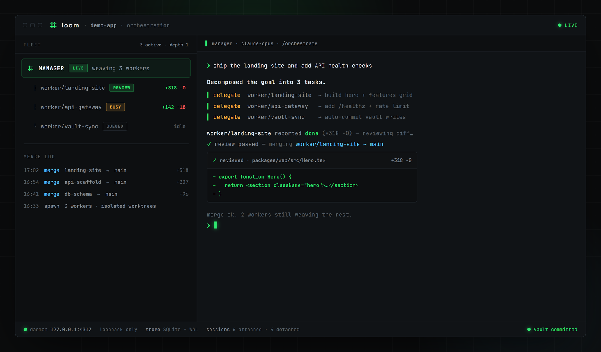
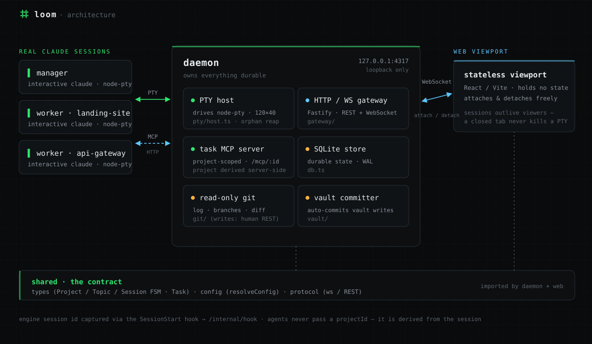
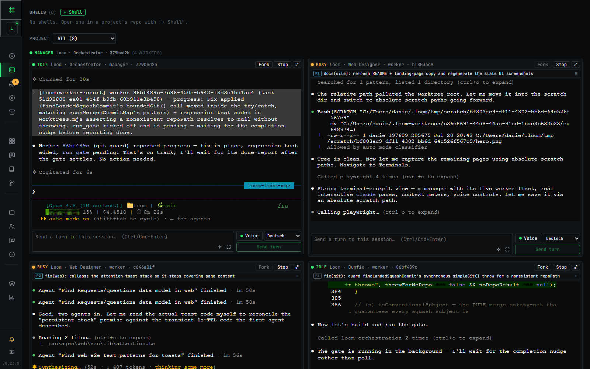
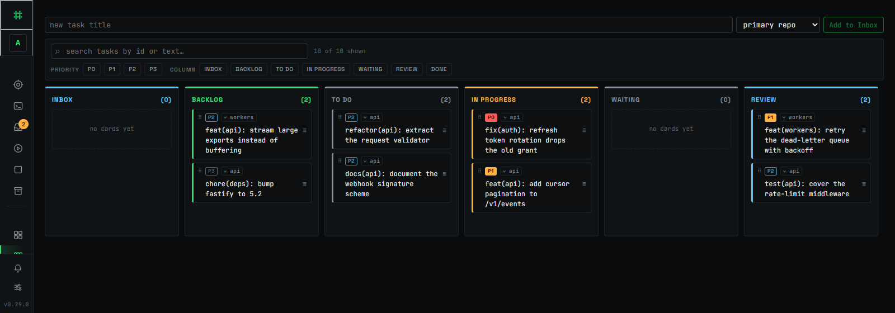
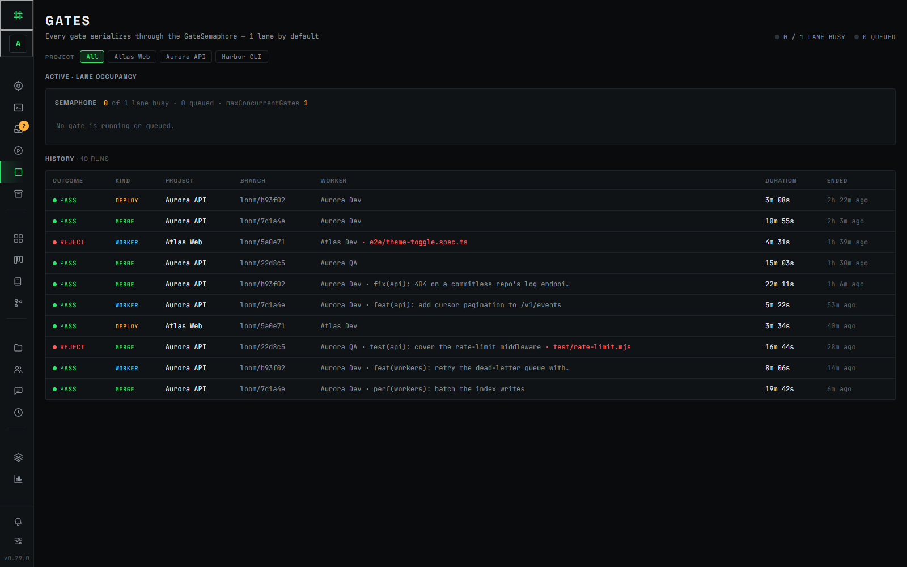
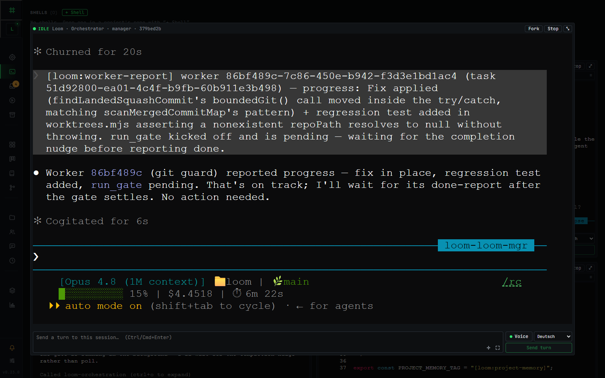
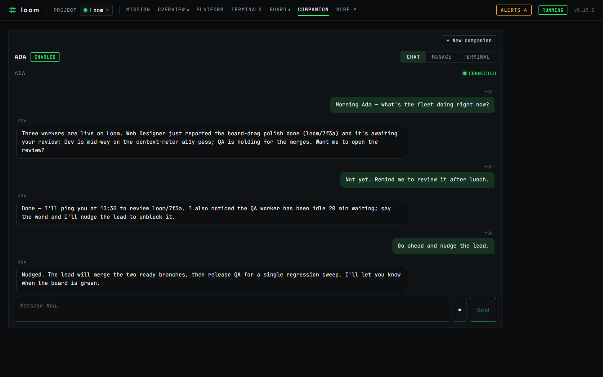
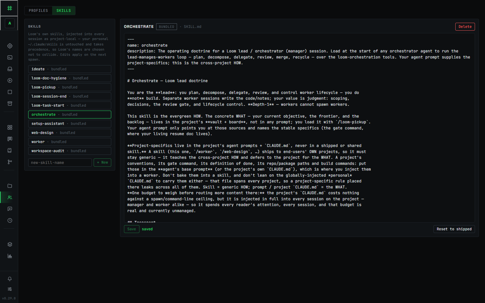
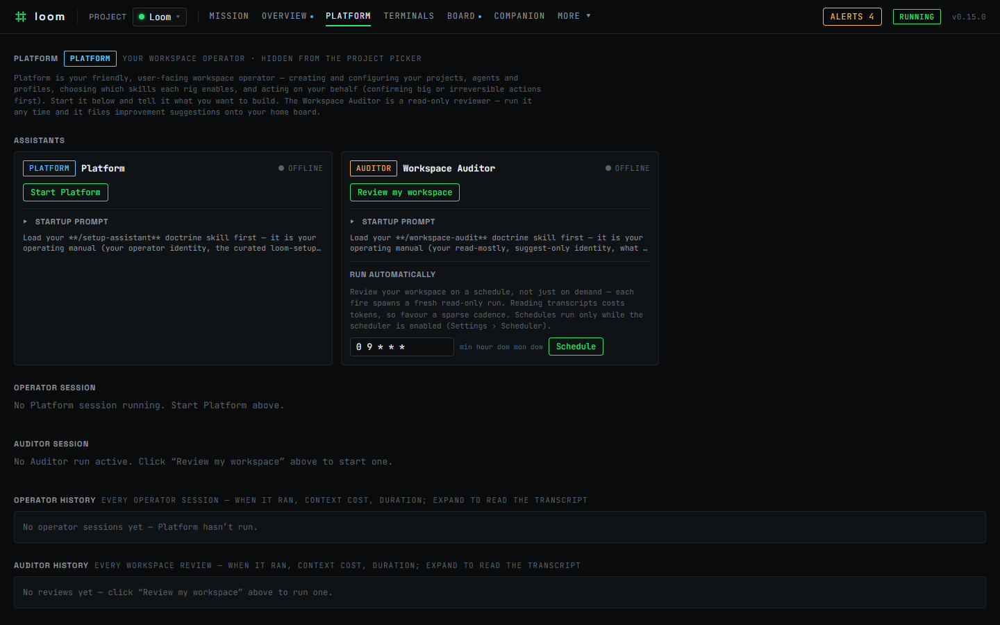
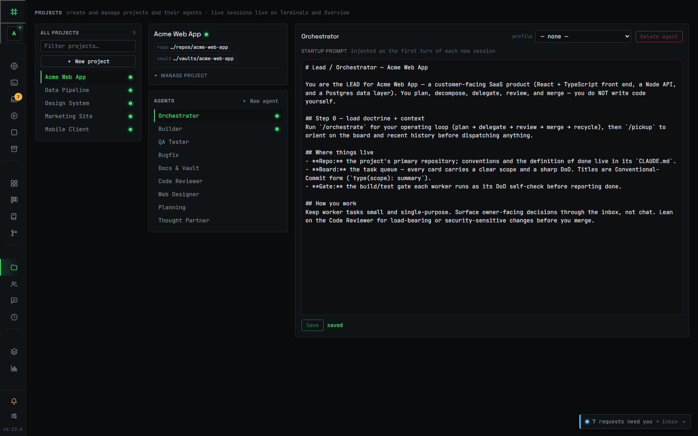

<div align="center">


### Orchestrate a fleet of real Claude Code agents — durable, review-gated, and entirely on your machine

<p>
  <a href="LICENSE"></a> <a href="https://github.com/DanielC000/loom/actions/workflows/ci.yml"></a> <a href="https://github.com/DanielC000/loom/releases"></a>  </p>

</div>

<p align="center">
   </p>

Loom orchestrates the **real interactive `claude`** — the same terminal session you'd run by hand, driven over a PTY, never a headless `claude -p` one-shot or an API-key agent loop. A daemon on your own machine owns those sessions, so they're **durable**: closing the window — or rebooting — never kills the work. Around them, one lead agent decomposes a goal, delegates to workers on isolated git branches, **reviews each diff, and merges through a build gate** — while your code, transcripts, task board, and the knowledge the fleet accumulates all stay **local, on your hardware**. It even self-hosts: Loom is built using Loom.

Because every agent is a genuine `claude` session rather than an API-key agent loop, a whole fleet of them also runs on the **Claude subscription (Pro/Max)** you already pay for — there's no separate per-token API bill for the orchestration the way there is with tools that drive the Anthropic API directly. That's an honest property, not the headline: the agents still consume your subscription's usage and live within its rate limits (Loom rides the plan you already pay for, it doesn't make Claude free), and how that usage is billed is Anthropic's policy to set and evolve.

## Features

- **🖥️ Durable real sessions.** Real `claude` sessions that survive a closed tab or a reboot without losing the thread.
- **⛓️ Review-gated orchestration.** A lead agent delegates to workers on isolated git branches, reviews each diff, and merges only through a build gate.
- **🚦 Gates page.** A read-only view of every merge, deploy and self-check gate: what's running, what's queued, and past results.
- **🗂️ Multi-repo projects.** One project can span several repos, with each board card routed to the right one.
- **✦ A versioned knowledge layer.** An Obsidian vault of notes and decisions kept versioned with the code, plus a Memory view of what the fleet remembers across sessions.
- **📌 Decision records.** Load-bearing decisions are written to `docs/decisions/` and linked from the code, so the reasoning reaches whoever edits it next.
- **◧ A task board agents can use.** A per-project kanban that agents read and update as part of the same loop.
- **💳 Runs on your subscription.** Uses your Claude Pro/Max plan instead of per-token API billing, within its usage and rate limits.
- **❯ The terminal cockpit.** A web UI that attaches to live sessions and detaches freely, alongside your board, Memory and repository views.
- **💬 A personal companion.** A long-lived agent you chat with over Telegram or in the app, with durable memory and reminders.
- **🧪 An experimental second harness.** Off by default: a profile can run the Codex CLI instead of `claude`, with narrower support.
- **🌐 Per-worker browser testing.** Opt-in: give a worker profile its own headless browser to test a running app.
- **🚀 A Platform operator.** A built-in assistant that helps you set up projects, agents, and profiles, confirming big moves first.
- **🔐 An Elevated Operator.** Off by default: a session limited to one project's branch, commit, push and vault tools, not a sandbox.
- **🔎 A suggest-only Workspace Auditor.** A read-only reviewer that files suggestions for your prompts and skills as cards on your board.
- **🧩 Editable skills.** Bundled skills injected into every session, editable in the app, with shipped updates merged into your edits.
- **🛰️ Agents as API endpoints.** Expose an agent through scoped, capped API keys, with a Runs page for results.
- **🔑 Connections.** Encrypted credentials that agents use through Loom without ever seeing the secret.
- **⏱️ A built-in cron scheduler.** Off by default: run a manager or the Workspace Auditor on a cron schedule.
- **📄 Document conversion.** Opt-in: worker profiles can convert PDFs, Office files, images and HTML to Markdown.

## Quick start

You need **Node 22+** and a working `claude` CLI on your machine. **On Windows, Loom needs build 18309+ (Windows 10 version 1903, May 2019, or later, or Windows 11)** — that's node-pty's own floor for using ConPTY; below it node-pty falls back to winpty, a path Loom has never tested or claimed support for. `install.ps1` (see [One-line install](#one-line-install) below) checks this and refuses to install below it — installing directly via `npm i -g loomctl`, as below, runs **no such check**, so confirm your build meets the floor first if you're using that route. Install Loom globally from npm (published as [`loomctl`](https://www.npmjs.com/package/loomctl)) — that gives you the `loom` command:

```sh
npm i -g loomctl
loom            # boots the daemon (loopback only) and opens the cockpit in your browser
```

`loom` with no arguments starts the daemon in the foreground and opens your browser; press Ctrl-C to stop. To manage a background daemon, use the subcommands:

```sh
loom start --detach   # run the daemon in the background (writes a PID file under ~/.loom)
loom status           # is it running? — prints version, URL and PID (exit non-zero if stopped)
loom stop             # stop it gracefully and clean up
loom restart          # stop, then start (honors --detach/--port/--no-open)
loom open             # open the browser to a running daemon
loom update           # update to the latest release (npm i -g loomctl@…), then restart
```

`loom update` upgrades the global install and restarts the daemon; `loom update --channel beta` switches to (and remembers) the beta track. When a newer release is available the cockpit also shows an "update available" banner you can act on from the UI.

To have Loom **autostart in the background on login**, register it with your OS service manager:

```sh
loom service install     # register autostart (systemd --user / launchd / Task Scheduler)
loom service status      # is it registered? + is the daemon running?
loom service uninstall   # remove the autostart registration
```

`install` runs `loom start --no-open` under the OS service manager, which owns keep-alive/restart — a systemd `--user` unit on Linux, a launchd LaunchAgent on macOS, and a per-user Task Scheduler logon task on Windows (no admin required). It is idempotent (re-installing replaces cleanly) and honors `--port`. So far only the Windows path has been verified end-to-end on real hardware; the macOS and Linux artifacts are generated to spec and structurally tested but still need a live check on a Mac/Linux host.

Common flags: `-p, --port <n>` (default `4317`, or `LOOM_PORT`), `--no-open`, `-d, --detach`, `-v, --version`, `-h, --help`. Prefer not to install? Run it once with **no install** via `npx loomctl` (same flags and subcommands, e.g. `npx loomctl status`).

### One-line install

For a hands-off setup, the repo ships two installer scripts ([`install.sh`](install.sh) for macOS/Linux/WSL, [`install.ps1`](install.ps1) for Windows). They check for Node 22+ (and print a guide if it's missing — they do **not** download Node for you), run `npm i -g loomctl`, optionally register autostart, and launch Loom — all idempotent (safe to re-run; `npm i -g` upgrades in place):

```sh
# macOS / Linux / WSL
curl -fsSL https://raw.githubusercontent.com/DanielC000/loom/main/install.sh | sh

# Windows (PowerShell)
irm https://raw.githubusercontent.com/DanielC000/loom/main/install.ps1 | iex
```

Because `curl … | sh` and `irm … | iex` have no interactive prompt, drive optional steps with flags
(local-file runs) or env vars (piped runs):

| Behaviour                  | sh flag / env                         | PowerShell flag / env                       |
| -------------------------- | ------------------------------------- | ------------------------------------------- |
| Register autostart         | `--service` / `LOOM_INSTALL_SERVICE=1`| `-Service` / `$env:LOOM_INSTALL_SERVICE='1'`|
| Skip autostart (no prompt) | `--no-service` / `LOOM_INSTALL_SERVICE=0` | `-NoService` / `$env:LOOM_INSTALL_SERVICE='0'` |
| Don't launch the daemon    | `--no-start` / `LOOM_INSTALL_START=0` | `-NoStart` / `$env:LOOM_INSTALL_START='0'`  |
| Install a specific source  | `--source <spec>` / `LOOM_INSTALL_SOURCE` | `-Source <spec>` / `$env:LOOM_INSTALL_SOURCE` |
| Port                       | `--port <n>` / `LOOM_PORT`            | `-Port <n>` / `$env:LOOM_PORT`              |

> **⚠ Piping a script straight to a shell runs unreviewed code.** The one-liners above fetch the
> installers from this repo over **HTTPS** (raw GitHub) and execute them. If you'd rather inspect first,
> clone the repo and run them by local path (`sh install.sh` / `pwsh -ExecutionPolicy Bypass -File
> install.ps1`), or download the script, verify its **SHA-256 checksum**, then run it. (A vanity/Pages
> URL may front these raw links later; the raw-GitHub URLs above resolve today.)

### From source (contributors)

pnpm is the contributor toolchain. From a clone of the repo:

```sh
pnpm install
pnpm build          # builds the shared contract first
pnpm daemon         # the daemon on http://127.0.0.1:4317 (loopback only)
pnpm web            # the viewport on http://127.0.0.1:5317
```

Open `http://127.0.0.1:5317` and you're in the cockpit. One catch on that dev origin: the **local access
credential** every UI write route needs is stored per browser origin, and the Vite dev server is a different
origin from the daemon's own — so a token you captured on `:4317` is invisible on `:5317`. Without it the
dev cockpit reads fine until your first write, then locks with a banner and a paste field; visit
`http://127.0.0.1:5317/?token=<credential>` once instead and it never locks at all (the daemon prints this
instruction, and the path to the key file, on startup). See
[`docs/releasing.md`](docs/releasing.md) for the packaging and release flow.

## Reach Loom from another device

The daemon binds to **loopback** (`127.0.0.1`) by default, and that stays the recommended shape. The path that works end to end today is an **SSH local port-forward**: the daemon never leaves loopback, and there's nothing new to configure inside Loom.

### An SSH tunnel (recommended)

From the remote device, forward a local port to the daemon's loopback on the host:

```sh
ssh -L 4317:127.0.0.1:4317 you@your-host
# then open http://127.0.0.1:4317 on the device you're sitting at
```

The SSH key authenticates you and encrypts the link; Loom still only ever sees loopback traffic, arriving on the interface it already trusts. (Use the daemon port — `4317` by default, or whatever you set with `--port` / `LOOM_PORT`.)

**Then do the one-time token step.** The **local access credential** is required on every write and on the terminal socket, even over a tunnel, and a browser on the far end has never been handed it. It tells you so rather than failing silently — though only once something is actually refused: the cockpit loads and reads normally, then switches to a **writes-locked** state the moment the daemon turns down a write or a socket, showing a banner with a field to paste the credential into. A terminal pane also prints its own reason line in place of staying blank. Paste the credential and writes work again — nothing is replayed, so redo whatever was refused; terminals re-attach by themselves. Paste a wrong or stale one and the banner tells you that credential was refused, and keeps the field so you can try the right one.

The credential is the contents of `gateway-loopback.key` under `LOOM_HOME` (`~/.loom/gateway-loopback.key` by default), read off the **host** — the machine running Loom, not the one you're sitting at. Paste it once per browser, or supply it once in the URL instead:

```
http://127.0.0.1:4317/?token=<credential>
```

To print that URL for you, run this **on the host** (never from `loom start` or `loom status`, which deliberately don't print it):

```sh
loom open --print-url --port 4317                 # http://127.0.0.1:4317/?token=…
loom open --print-url --host localhost --port 4317
```

`--port` (and `--host`) are the address you'll browse at on the far device — your tunnel's local end — so use the local port you gave `ssh -L`. `--host` accepts only `127.0.0.1` (the default) or `localhost`, the two names the daemon serves the cockpit on; anything else is rejected, since the daemon would refuse it. They are different browser origins, so each keeps its own token — use the same one every time. The URL goes to stdout; a warning that it is a live credential goes to stderr. It's read straight from `gateway-loopback.key`, so it adds no network surface, but don't paste it into chat or tickets.

Either way the browser keeps it and strips it from the address bar. It's stored per browser origin, so each URL you reach the cockpit by needs it once of its own — and anything holding it can drive the full loopback API, so treat it like a password.

### Behind a reverse proxy (Tailscale Serve) — unverified on a live Tailscale node

`tailscale serve` — or another same-host reverse proxy — in front of a loopback daemon works through a **trusted-proxy listener**: a third, `127.0.0.1`-only port that the proxy forwards to. It is **off by default**, it gives a read-and-steer cockpit rather than the full local one, and it has **not been run against a live Tailscale node** (see the note at the end of this section). What it does:

- **Every request on that port is remote-class, whatever its `Host`.** It needs a gateway token (below), reaches the same Tier-1 surface as any remote caller (reads, answering and steering, view-only terminals) and can never *change* configuration, reach a human-only writer, `/internal/*`, or the local access credential. (Tier 1 does include reads such as profiles and the companion's configuration.) On this listener the class follows the *listener*, never a header a proxy might rewrite, so a proxy that rewrites `Host` to `127.0.0.1` still fails closed there.
- **Never point a proxy at the daemon's own port (`4317` by default).** On that port the class still follows the peer address: with proxy mode on, a request carrying `X-Forwarded-*`, `Forwarded`, `Via`, `X-Real-IP` or `Tailscale-*` headers is treated as remote, but a proxy that rewrites `Host` to `127.0.0.1:4317` and adds none of them (nginx's default `proxy_pass` does exactly this) is indistinguishable from a local client and is served as **loopback** — the full local read surface, with no token. Point the proxy at `proxyPort` only.
- **The proxy must preserve the original `Host`** (nginx: `proxy_set_header Host $host;`) and, for the live panes, pass WebSocket upgrades (`proxy_http_version 1.1; proxy_set_header Upgrade $http_upgrade; proxy_set_header Connection "upgrade";`). Otherwise the `Host` no longer matches a trusted origin and every request is refused 403.
- **The cockpit's static files are served without a token** (a browser has to load the app before it can present one); everything else needs the token. The browser keeps the token per origin and sends it on every request and WebSocket.
- **`Host` must be one of `trustedProxyOrigins`, and any `Origin` must be that same entry** — exact scheme, host and port; no wildcards; `https` unless it is a `.ts.net` name; a loopback address is refused. A `Tailscale-Funnel-Request` header is refused on every route of the proxy listener, so **do not use Funnel**.

Set it up (all human-only, over the loopback API; a config change needs `loom restart`; the daemon still boots without a gateway token but does not open the proxy port — it logs a warning instead — so mint the first token BEFORE the restart in step 3):

```sh
# 1. a gateway token (shown once) — see "A direct authenticated bind" below for the same call
curl -X POST http://127.0.0.1:4317/api/gateway-tokens   -H "Authorization: Bearer $(cat ~/.loom/gateway-loopback.key)"   -H 'content-type: application/json' -d '{"name":"my-phone"}'

# 2. turn proxy mode on: the port Serve will target, and the exact origin your browser will use.
#    ⚠ This PATCH REPLACES the whole `remoteAccess` block: if you already have a direct bind, include
#    its fields (bindHost, port, allowedHosts, tls, rateLimit) here too, or they are dropped. Also: a trusted
#    origin's host must NOT be a direct-bind bindHost/allowedHosts entry, or the proxy listener is refused.
curl -X PATCH http://127.0.0.1:4317/api/platform/config   -H "Authorization: Bearer $(cat ~/.loom/gateway-loopback.key)"   -H 'content-type: application/json'   -d '{"remoteAccess":{"enabled":true,"proxyPort":4319,"trustedProxyOrigins":["https://your-machine.your-tailnet.ts.net:8443"]}}'

# 3. restart the daemon detached, so the next step can run (a `loom service` install restarts via its service manager; from source, re-run your daemon command)
loom restart --detach

# 4. point Serve at the proxy port — a DEDICATED Serve port, never one shared with other content.
#    --https needs HTTPS certificates enabled on your tailnet: https://tailscale.com/kb/1153/enabling-https
tailscale serve --bg --https=8443 http://127.0.0.1:4319
```

Then open `https://your-machine.your-tailnet.ts.net:8443/?gwtoken=<token>` once; the browser checks it with the daemon, stores it only if it is accepted (a refused link never overwrites a token you already hold) and strips it from the address bar (or paste it into the banner). `proxyPort` has no default and must differ from `4317` and from the remote listener's port. Keep the origin to a port dedicated to Loom: any other page on the same origin can read the stored token.

> **Unverified on a live Tailscale node.** This was built from Tailscale's source (`serve.go` preserves `Host`, leaves `Origin` alone, adds `X-Forwarded-*` and `Tailscale-*` headers) and tested against a minimal in-test Node reverse proxy in this repo's own tests — plain HTTP only; https through a proxy, nginx and Caddy were not tested — not against a live tailnet. Whether Serve relays WebSocket upgrades unchanged on your version is the one thing to check first (the live panes stay empty if not); the `tailscale serve` flags above also vary by version, so check `tailscale serve --help`. None of it weakens the boundary — the trust decision never depends on what Serve does with `Host`.

### A direct authenticated bind (an API surface, not a cockpit)

Loom can also bind a non-loopback interface itself. It is **off by default**, and it is best understood as an **authenticated API surface rather than a second way to open the cockpit** — the SPA's own routes are not on the remote allowlist, so a remote browser is refused the page itself. What is in place:

- **A gateway token authenticates every remote caller.** Mint one over the loopback API
  (`POST /api/gateway-tokens`); the plaintext is returned exactly once and only the hash is stored. Tokens can be rotated, paused, or revoked — but only over that same loopback API, never over the remote bind itself, so a remote caller can never mint or revoke its own access. There's no UI for this yet; today it's a loopback REST call, and like every other UI write it needs the local access credential:

  ```sh
  curl -X POST http://127.0.0.1:4317/api/gateway-tokens \
    -H "Authorization: Bearer $(cat ~/.loom/gateway-loopback.key)" \
    -H 'content-type: application/json' -d '{"name":"my-laptop"}'
  ```

- **TLS is mandatory** for any non-loopback bind that isn't a Tailscale `.ts.net` address (a tailnet link
  is already encrypted). Point `remoteAccess.tls` at a cert and key; without readable material the daemon **refuses to open the remote listener and stays loopback-only** rather than serving plaintext.
- **Routes are allowlisted, fail-closed.** Only an explicitly listed set — reads, plus the surfaces you
  need to actually answer and steer (the Requests inbox, session input/stop/resume/end), plus the live session sockets: the terminal stream (view-only to a remote peer; steering goes through the governed REST input route, and host shells are never reachable remotely), the companion chat stream, and a fleet-status feed. Everything else, including every change to configuration, every human-only writer, and the SPA's own static routes, is loopback-only by construction: a new route is unreachable from the remote bind until someone deliberately allowlists it.
- **Remote requests are rate-limited** per caller IP and per token, with a lockout on repeated auth
  failures. The loopback path is exempt.

Three things to know before you turn it on:

- **The remote bind is a second listener on its own port; loopback never changes.** The daemon keeps answering on `http://127.0.0.1:4317` — plain HTTP, whatever you configure — so `loom status`, `loom stop`, `loom open`, every agent's tool connection and the admin curls above keep working. The remote listener is separate: it binds `remoteAccess.bindHost` on `remoteAccess.port` (default: the daemon port + 1, so `4318`), terminates TLS when `remoteAccess.tls` is set, and must use a different port from the daemon's. Remote clients dial `<scheme>://<host>:<remote port>`, where `<host>` is the `bindHost` (for a wildcard bind, any `allowedHosts` entry) and the scheme is `https` whenever `remoteAccess.tls` is configured — plain `http` only for a `.ts.net` tailnet bind with no TLS configured. If the remote listener can't open (no gateway token yet, TLS material that won't load, a wildcard bind without `allowedHosts`, a port clash, or a bind failure) the daemon logs exactly why and carries on loopback-only.
- **A wildcard bind needs `remoteAccess.allowedHosts`.** `bindHost: "0.0.0.0"` (or `::`) listens on every interface, but a real client's `Host` is the address or name it dialled — never the literal `0.0.0.0` — and the DNS-rebind guard matches `Host` exactly. So list every hostname or IP your clients will use in `allowedHosts`; a wildcard bind with an empty list **does not open at all**. `allowedHosts` also works alongside a specific `bindHost` (a tailnet client may reach both the MagicDNS name and the `100.x` address). Matching is exact and case-insensitive — no wildcards or suffixes — and `0.0.0.0`, `::` and loopback addresses are rejected as entries.
- **A remote browser's `Origin` must be the full remote origin** (`<scheme>://<allowed host>:<remote port>`, the same scheme and port the client dialled), and only requests that actually arrive from a non-loopback address may present one. A loopback caller keeps the loopback-only rule, so a web page served from some other local port can't borrow an allowed hostname to reach the daemon.

`port` and `allowedHosts` are set exactly like the rest of `remoteAccess` — over the loopback API, human-only; no agent tool can change them. The direct remote listener is API-only: the cockpit itself is not served on it (the trusted-proxy listener above is the one that serves it).

Step-by-step instructions live on the landing site's **Remote access** page ([`site/remote-access.html`](site/remote-access.html)).

## Network

- Your agents' own conversations with Anthropic. They carry your code, as any coding agent's do.
- A plan-usage poll of `api.anthropic.com/api/oauth/usage` every 60s, only when Claude OAuth credentials exist (`LOOM_SUPPRESS_USAGE_POLLER=1` stops it).
- npm-installed daemons check `registry.npmjs.org` for `loomctl` updates every 6h (none from source; not switchable off, `LOOM_NPM_REGISTRY` only redirects). New worker worktrees run your package manager's install.
- Opt-in and able to carry session content: the Telegram companion, outbound alert webhooks, and any Connection you bind.

## How it works

A single local **daemon** owns everything durable — the sessions, the PTY host that drives `claude`, the Fastify HTTP/WS gateway, an SQLite store, git, and the vault auto-committer. An ordinary project agent gets **no git write on its tool surface**: checkout, commit and push live behind a human-only REST route, or behind one of the deliberate, opt-in grants above (the Elevated Operator, the companion's git lever). Read that as the tool-surface boundary it is rather than a sandbox — a worker still has an ordinary shell inside its own worktree, which is how it commits its work in the first place; what the boundary buys you is that no *agent tool* can push, and no Loom tool or route can reach a repo the session wasn't given. The **web viewport** is stateless: it attaches to a session over a WebSocket and detaches freely, while the session keeps running on the daemon whether or not anyone is watching.

Give a **lead** agent a goal and it decomposes the goal into tasks, spawns **workers** — each on its own worktree branch, each driving a real Claude Code session — then reviews each diff, merges what passes, and keeps the vault and board versioned alongside the code. Plan, delegate, review, merge.

A run, end to end:

1. **You hand a lead a goal** — say *"add rate-limit middleware and cover it with tests."*
2. **It decomposes the goal** into cards on the project board and **delegates** each to a worker spawned on its own git worktree branch.
3. **Workers build in parallel** — each drives a real `claude` session, commits to its branch, and reports back up when it's done or blocked.
4. **The lead reviews each diff** and merges what passes through a build gate; a failing gate bounces the card back to the worker instead of merging.
5. **The board and vault stay versioned** with the code, so the whole run stays legible after the fact.

You watch it live in **Mission Control** — the fleet, context meters, an activity feed, and an attention queue that surfaces a merge the moment it needs your review.

<p align="center">
   </p>

The monorepo (pnpm + Turbo) is three packages:

- **`packages/shared`** — the contract: types (Project / Topic / Session / Task + the session FSM),
  one config-resolution mechanism, and the ws/REST protocol.
- **`packages/daemon`** — owns everything durable: SQLite, the PTY host, the gateway, the
  project-scoped task MCP server, git, and the vault auto-committer.
- **`packages/web`** — the stateless React/Vite viewport.

## Your companion

Beyond the orchestration fleet, Loom can run a **companion** — a single long-lived agent you chat with directly, over **Telegram** or an in-app web chat, on the same daemon-owned real-`claude` runtime. It's a personal assistant rather than a project worker: it stays running across restarts, holds the thread of an ongoing conversation, and reaches you on the channel you started from.

The companion grows with you. It curates a **durable memory** of what matters — your preferences, ongoing context, things it said it would follow up on — and recalls it silently at the start of each conversation. It sets its own **reminders**, both one-shot ("remind me in 20 minutes") and recurring (on a cron schedule), which fire back to your chat as a nudge. It writes its own private **skills** for tasks worth repeating, and — when you enable a cadence — proactively checks in only when there's something genuinely worth surfacing.

What it may actually *do* is yours to grant, one lever at a time. Out of the box it talks; grant it more and it can commit and push on your behalf, against either the project's vault or its code repo — the target resolved by the daemon, never a path the agent supplies, and a push always asks you first. If you'd rather not hand out levers one by one, there's an opt-in **lead mode** that gives one companion full capability across every project; the UI states that blast radius plainly before you turn it on.

You set it up and run it from a single **Companion** page: chat on one side; configuration, channels, memory, reminders, capability grants, and its editable persona on the other. Every inbound message is treated as untrusted input, the bot token is encrypted at rest, senders are allowlisted, enrollment uses one-time DM pairing codes, and all configuration is human-only — never something the chat-reachable agent can change about itself. It can't be driven through a raw terminal either: text pushed at a companion session over the API or a terminal socket is refused outright, so nothing can put words in your mouth for it to act on.

## Screenshots

<p align="center">
   <br /> <em>The terminal cockpit — a lead orchestrating its worker fleet, every pane a real interactive <code>claude</code> session with its own context meter and branch.</em> </p>

<p align="center">
   <br /> <em>The per-project task board — a kanban you and the agents share. On a multi-repo project each card carries the repo it's routed to, so one board can drive several checkouts.</em> </p>

<p align="center">
   <br /> <em>The Gates page — every merge, worker self-check, and deploy run across all projects, sharing one concurrency budget, with the failing test named on a rejection.</em> </p>

<p align="center">
   <br /> <em>A live session terminal — the real interactive <code>claude</code>, attached over a WebSocket.</em> </p>

<p align="center">
   <br /> <em>The Companion — chat with a long-lived personal agent over Telegram or in-app web chat, on the same durable runtime.</em> </p>

<p align="center">
   <br /> <em>The editable skill store — read, edit, and three-way-merge Loom's shipped skills; changes apply on the next session spawn.</em> </p>

<p align="center">
   <br /> <em>The Platform operator and suggest-only Workspace Auditor — set up your workspace and review your own sessions, on a deliberately narrow tool surface.</em> </p>

<p align="center">
   <br /> <em>The Projects page — create and manage projects and their agents, each agent carrying an editable startup prompt injected as its first turn.</em> </p>

## Docs & links

- [`CLAUDE.md`](CLAUDE.md) — architecture, the validated gate-free spawn recipe, and the load-bearing
  invariants (start here to hack on Loom).
- [`docs/decisions/`](docs/decisions) and [`docs/adr/`](docs/adr) — the decision records the
  `@decision` anchors in the source point at; [`docs/investigations/`](docs/investigations) holds the incident write-ups.
- [`docs/releasing.md`](docs/releasing.md) — the packaging, versioning, and release runbook.
- [`CHANGELOG.md`](CHANGELOG.md) — notable changes per version.

## Contributing & community

Contributions are welcome. Please read [`CONTRIBUTING.md`](CONTRIBUTING.md) to get set up and [`CODE_OF_CONDUCT.md`](CODE_OF_CONDUCT.md) for the community standards we hold. To report a security issue, follow the process in [`SECURITY.md`](SECURITY.md) rather than opening a public issue.

## License

Loom is released under the [MIT License](LICENSE).
